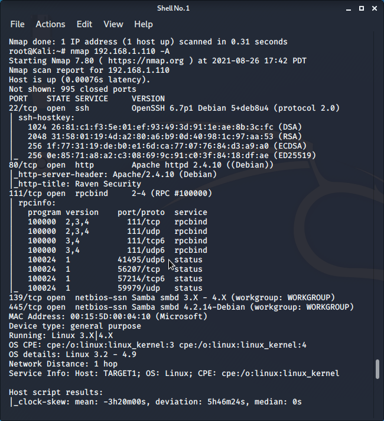
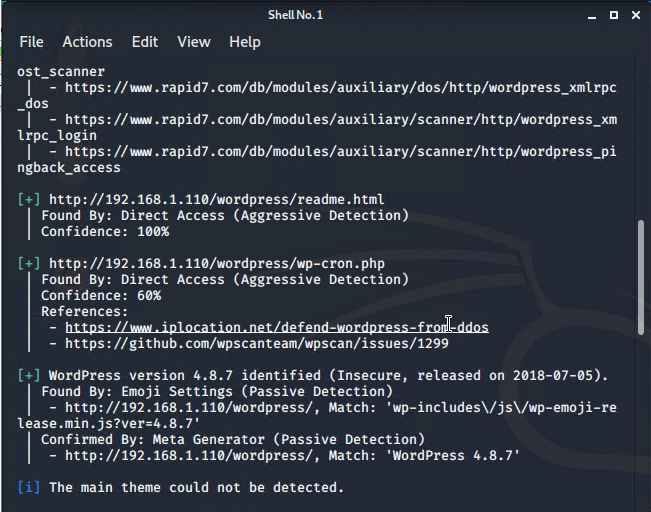

# Red Team: Summary of Operations

## Table of Contents
- Exposed Services
- Critical Vulnerabilities
- Exploitation

### Exposed Services


Nmap scan results for each machine reveal the below services and OS details:

```bash
$ nmap 192.168.1.110 -A
```
  

```bash
This scan identifies the services below as potential points of entry:

- Target 1
  - List of exponsed service:
   
  22  SSH
  80  http
  111  rpcbind
  139 netbios-ssn
  445 microsoft-ds


The following vulnerabilities were identified on each target:
- Target 1
  - List of Critical Vulnerabilities
```  
  
 
 
 ```bash
   Port    Service      Version 
   22      ssh          OpenSSH 6.7p1
   80      http         Apache httpd 2.4.10
   111     rpcbind      2-4
   139     netbios-ssn  Samba smdb 3.x
   445     netbios-ssn  Samba smbd 3.x
   
   1. Open SSH 
  - CVE-2016-0777 
  - CVE score of 4.0 
2. Open NetBIOS -ssn Samba 
  - CVE-2014-0178        CVE-2014-0244 
  - CVE score of 3.5     CVE score of 3.3 
3. Weak Passwords 
  - CVE-2020-7519 also called CWE-521 
  - CVE score of 5.0
 ```

   

### Exploitation


The Red Team was able to penetrate `Target 1` and retrieve the following confidential data:

   ```bash
    - Exploit Used
      - A WPScan was used to identify the users and vulnerable plugin on the Wordpress server: 
      - The command used:  wpscan --url http://192.168.1.110/wordpress -eu
      - The following information was gathered from the wpscan:
   ``` 
   
   
   
    
  ```bash
    - A user shell was obtained on michael using 'ssh michael@192.168.1.110'.  A weak password of his own name, michael, was used to log in to the machine.
    - Inside /var/www, flag 2 was revealed via an 'ls' command, and the output was found using a cat
  - `flag2.txt`: 
  ```
  
  
  
  ```bash
     - From /var/www, a grep was performed to find Flag1: grep -RE flag html 
     - A lengthy output resulted, but the first flag was found at the end of the output.
  
- Target 1
  - `flag1.txt`:
  ```
   
